<!-- ══════════════════ HEADER ══════════════════ -->

 

 

<table>
<tr>
<td>

🔩 &nbsp; Custom **KiCad component library** built for the **STM32F407VET6 development board** PCB design.
 
🏛️ &nbsp; Created for the **eSim PCB Design Project** under **FOSSEE, IIT Bombay**.
 
📐 &nbsp; Contains every **symbol, footprint, 3D model, and silkscreen bitmap** used on the board.

</td>
</tr>
</table>

## 📋 Board Specs

<table>
<tr>
<td align="center" width="33%">

**🧠 MCU**
  

 
ARM Cortex-M4 &nbsp;·&nbsp; FPU
 
`168 MHz`

</td>
<td align="center" width="33%">

**💾 On-Chip Memory**
  

 
\+ 16 Mbit External SPI Flash
 
`W25Q16FWUIQ`

</td>
<td align="center" width="33%">

**💎 Clocks**
  

 
PLL → 168 MHz System Clock
 
`RTC Backup via CR1220`

</td>
</tr>
<tr>
<td align="center">

**⚡ Power**
  

 
USB / DC Barrel Jack Input
 
`BAT54C reverse protection`

</td>
<td align="center">

**🔌 I/O Expansion**
  

 
Micro USB &nbsp;·&nbsp; Micro SD &nbsp;·&nbsp; JTAG/SWD
 
`All GPIO broken out`

</td>
<td align="center">

**🎨 Silkscreen**
  

 
ARM · Cortex-M4 · FOSSEE · STM
 
`Designer signature engraved`

</td>
</tr>
</table>

## 🗂️ What's Inside

> Each component folder bundles up to **3 assets** — the schematic symbol, PCB footprint, and 3D model — all in one place. Standalone footprints and silkscreen bitmaps live at the root level.

&nbsp;🔣&nbsp;&nbsp;<b>SYMBOLS</b>&nbsp;&nbsp;<code>.kicad_sym</code>&nbsp;&nbsp;—&nbsp;&nbsp;Schematic capture

 

> Packaged inside each component folder. One symbol per component.

| # | Symbol | Folder | What It Represents |
|:---:|:---|:---|:---|
| 1 | `STM32F407VET6` | `MCU-STM32F407VET6_LQFP100_/` | 100-pin MCU — all GPIO/power/analog pins mapped |
| 2 | `AMS1117-3.3` | `AMS1117-3.3/` | 3.3V LDO regulator (IN / OUT / GND) |
| 3 | `W25Q16FWUIQ` | `W25Q16FWUIQ/` | 16Mbit SPI Flash (CLK/DI/DO/CS) |
| 4 | `BAT54C` | `BAT54C_RFG/` | Dual Schottky diode |
| 5 | `CR1220` | `CR1220/` | Coin cell battery holder |
| 6 | `B3F-1000` | `B3F-1000/` | Tactile push button |
| 7 | `10118193-0001LF` | `10118193-0001LF/` | Micro USB Type-B |
| 8 | `GSD090012SEU` | `GSD090012SEU/` | Micro SD card slot |
| 9 | `MEM2075-00-140-01-A` | `MEM2075-00-140-01-A/` | Micro SD connector |
| 10 | `ABM8AIG-8.000MHZ` | `ABM8AIG-8.000MHZ-1Z-T/` | 8 MHz crystal |
| 11 | `ABS07-32.768KHZ` | `ABS07-32.768KHZ-T/` | 32.768 kHz crystal |
| 12 | `TSW-116-07-G-D` | `TSW-116-07-G-D/` | 2×16 dual-row header |
| 13 | `TSW-124-07-G-D` | `TSW-124-07-G-D/` | 2×24 dual-row header |
| 14 | `PPPC042LFBN-RC` | `PPPC042LFBN-RC/` | 2×4 female socket |
| 15 | `61300411121` | `61300411121/` | 4-pin header (Würth) |
| 16 | `6120XX21621` | `6120XX21621_61202021621/` | Pin header (Würth) |
| 17 | `MCSJK Barrel Jack` | `LIB_MCSJK-7I-8.00-18-30-60-8-30/` | DC power jack |
| 18 | `LED 0603` | `ledsmd597-3305-607F/` | SMD LED indicator |
| 19 | `PNP Transistor` | `pnp/` | PNP BJT |

&nbsp;🦶&nbsp;&nbsp;<b>FOOTPRINTS</b>&nbsp;&nbsp;<code>.kicad_mod</code>&nbsp;&nbsp;—&nbsp;&nbsp;PCB land patterns

 

> Component-specific footprints live inside their folders. These are the **standalone generic footprints** at the library root:

| # | Footprint File | Package | Use Case |
|:---:|:---|:---|:---|
| 1 | `C_0805_2012Metric_Pad1.18x1.45mm_HandSolder.kicad_mod` | `0805` | Capacitors — hand-solder pads |
| 2 | `R_1206_3216Metric.kicad_mod` | `1206` | Resistors — standard |
| 3 | `Crystal_SMD_3225-4Pin_3.2x2.5mm.kicad_mod` | `3225` | Crystal oscillator |
| 4 | `SOT-223-3_TabPin2.kicad_mod` | `SOT-223` | Voltage regulators (tab=pin2) |
| 5 | `SOT-23.kicad_mod` | `SOT-23` | Small-signal transistors / diodes |

&nbsp;📐&nbsp;&nbsp;<b>3D MODELS</b>&nbsp;&nbsp;<code>.step</code> <code>.wrl</code>&nbsp;&nbsp;—&nbsp;&nbsp;Mechanical visualization

 

> 3D STEP/VRML models for board visualization, clearance checks, and enclosure fitting.

| # | Folder | Contents |
|:---:|:---|:---|
| 1 | `3d_capacitor/` | STEP models for ceramic caps (various sizes) |
| 2 | `3d_resistor/` | STEP models for chip resistors (various sizes) |
| 3 | *Each component folder* | Component-specific 3D models bundled with symbol + footprint |

&nbsp;🎨&nbsp;&nbsp;<b>SILKSCREEN BITMAPS</b>&nbsp;&nbsp;<code>*_bitmap.kicad_mod</code>&nbsp;&nbsp;—&nbsp;&nbsp;PCB art & branding

 

> Bitmap images converted to KiCad footprints for silkscreen / copper layer engraving.
> These are what make the PCB **uniquely yours**.

| # | File | Art | Purpose |
|:---:|:---|:---:|:---|
| 1 | `arm_bitmap.kicad_mod` | 🏷️ | ARM architecture logo |
| 2 | `armcotexm4_bitmap.kicad_mod` | 🧠 | Cortex-M4 core branding |
| 3 | `fossee_bitmap.kicad_mod` | 🏛️ | FOSSEE / IIT Bombay logo |
| 4 | `mhz168_bitmap.kicad_mod` | ⏱️ | "168 MHz" clock speed label |
| 5 | `protocol_bitmap.kicad_mod` | 📡 | SPI / I2C / UART protocol icons |
| 6 | `sanjay_bitmap.kicad_mod` | ✍️ | Designer signature |
| 7 | `sram_bitmap.kicad_mod` | 💾 | "192 KB SRAM" memory label |
| 8 | `FLASH_bitmap.kicad_mod` | 💽 | "512 KB Flash" memory label |
| 9 | `stm32f4ve_bitmap.kicad_mod` | 🔲 | MCU part number marking |
| 10 | `stm_bitmap.kicad_mod` | 🏭 | STMicroelectronics logo |

## 🧩 Component Map

> How every part connects on the board:

```mermaid
%%{init: {'theme': 'dark', 'themeVariables': { 'primaryColor': '#2d1b69', 'primaryBorderColor': '#cd7f32', 'primaryTextColor': '#f5deb3', 'lineColor': '#cd7f32', 'secondaryColor': '#1a1a2e', 'tertiaryColor': '#0d1117', 'fontSize': '13px'}}}%%
flowchart TB
    subgraph POWER ["⚡ POWER"]
        USB["🔌 Micro USB\n10118193-0001LF"]
        DC["🔩 DC Jack\nMCSJK"]
        BAT["🔋 CR1220\nRTC Backup"]
        DIODE["BAT54C\nProtection"]
        LDO["AMS1117-3.3\n→ 3.3V Rail"]
    end

    subgraph CORE ["🧠 CORE"]
        MCU["STM32F407VET6\nLQFP-100"]
        HSE["💎 8 MHz\nABM8AIG"]
        LSE["💎 32.768 kHz\nABS07"]
        FLASH["💾 W25Q16\nSPI Flash"]
        SD["📂 Micro SD\nGSD090012SEU"]
    end

    subgraph IO ["🔌 I/O"]
        H1["TSW-116\n2×16 Header"]
        H2["TSW-124\n2×24 Header"]
        H3["PPPC042\n2×4 Socket"]
        LED["💡 LED\nStatus"]
        BTN["🔘 B3F-1000\nReset / Boot"]
    end

    USB --> DIODE
    DC --> DIODE
    DIODE --> LDO
    BAT --> MCU
    LDO --> MCU
    HSE --> MCU
    LSE --> MCU
    MCU -->|SPI| FLASH
    MCU -->|SDIO| SD
    MCU --> H1
    MCU --> H2
    MCU --> H3
    MCU --> LED
    BTN --> MCU

    style POWER fill:#1a1a2e,stroke:#cd7f32,stroke-width:2px
    style CORE fill:#1a1a2e,stroke:#cd7f32,stroke-width:2px
    style IO fill:#1a1a2e,stroke:#cd7f32,stroke-width:2px
    style MCU fill:#2d1b69,stroke:#cd7f32,stroke-width:3px
```

## 🚀 How to Use

### Import into KiCad

<table>
<tr>
<td width="50" align="center">

**①**

</td>
<td>

**Clone or download** the `Libraries/` folder into your KiCad project directory.

</td>
</tr>
<tr>
<td align="center">

**②**

</td>
<td>

**Symbols** → *Preferences* → *Manage Symbol Libraries* → Add `.kicad_sym` files from each component folder.

</td>
</tr>
<tr>
<td align="center">

**③**

</td>
<td>

**Footprints** → *Preferences* → *Manage Footprint Libraries* → Point to `Libraries/` as a library path. Both component-specific and standalone `.kicad_mod` files will be discovered.

</td>
</tr>
<tr>
<td align="center">

**④**

</td>
<td>

**3D Models** → Auto-resolve if folder structure is preserved. Check *Footprint Properties → 3D Models* tab to verify paths.

</td>
</tr>
<tr>
<td align="center">

**⑤**

</td>
<td>

**Bitmaps** → Import `*_bitmap.kicad_mod` files as footprints. Place them on the `F.SilkS` or `F.Cu` layer for branding.

</td>
</tr>
</table>

## 🪪 Attribution

Designed by **Sanjay G** &nbsp;·&nbsp; **eSim PCB Design Project** &nbsp;·&nbsp; **FOSSEE, IIT Bombay**

 

<!-- FOOTER WAVE -->

